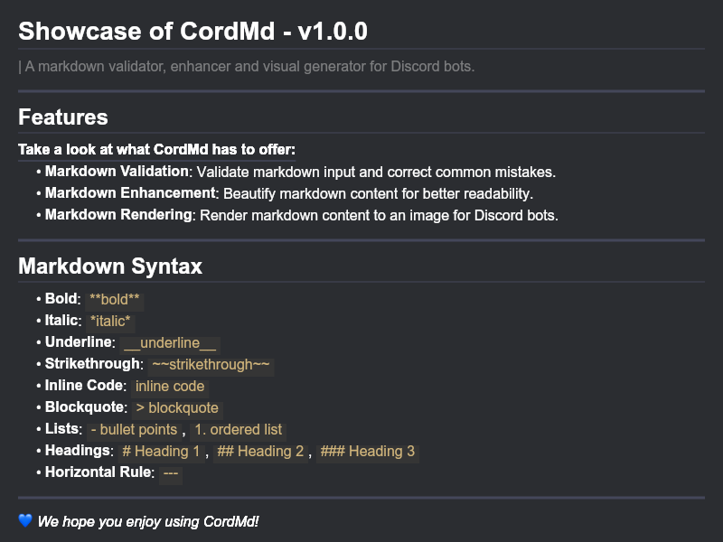

# CordMd - v1.0.0
> CordMd is a markdown validator, enhancer, and visual generator designed for Discord bots. It can render markdown content as an image buffer, ideal for use in Discord via `AttachmentBuilder`.

---

## Installation

> Cord.md is not avaliable via npm but you can download this git and use npm link to link use in your projects.

```bash
git clone https://github.com/openoccult/cordmd.git
cd cordmd
npm link
```

## Features
__**Take a look at what CordMd has to offer:**__
- **Markdown Validation**: Validate markdown input and correct common mistakes.
- **Markdown Enhancement**: Beautify markdown content for better readability.
- **Markdown Rendering**: Render markdown content to an image for Discord bots.
---
## Markdown Syntax
- **Bold**: `**bold**`
- **Italic**: `*italic*`
- **Underline**: `__underline__`
- **Strikethrough**: `~~strikethrough~~`
- **Inline Code**: `inline code`
- **Blockquote**: `> blockquote`
- **Lists**: `- bullet points\`, `1. ordered list`
- **Headings**: `# Heading 1`, `## Heading 2\`, `### Heading 3\`
- **Horizontal Rule**: `---`
---

## Usage
```js
const { renderMarkdown } = require('cordmd');
const { AttachmentBuilder } = require("discord.js");

const markdown = `# Hello World\nThis is **bold** text!`;

// Renders the markdown and returns an image buffer
const buffer = await renderMarkdown(markdown);
const image = new AttachmentBuilder(buffer, { name: 'file.jpg' });
```
> **`renderMarkdown` automaticaly validates your markdown input, so there's no need to call `validateMarkdown` separately. You can simply use `renderMarkdown` for both validation and rendering.**



--- 

## Discord Usage Example

```js
const { Client, Intents } = require('discord.js');
const { renderMarkdown } = require('cordmd');
const { AttachmentBuilder } = require('discord.js');

const client = new Client({ intents: [Intents.FLAGS.GUILDS, Intents.FLAGS.GUILD_MESSAGES] });

client.on('messageCreate', async (message) => {
    if (message.content.startsWith('!render')) {
        const markdown = `# Welcome to Discord!\nThis is an example of **rendering markdown**.`;
        const buffer = await renderMarkdown(markdown);
        const attachment = new AttachmentBuilder(buffer, { name: 'file.jpg' });
        
        message.channel.send({ files: [attachment] });
    }
});

client.login('YOUR_BOT_TOKEN');
```

---

## Customization Options
Customization Inputs coming soon!